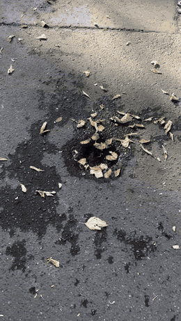
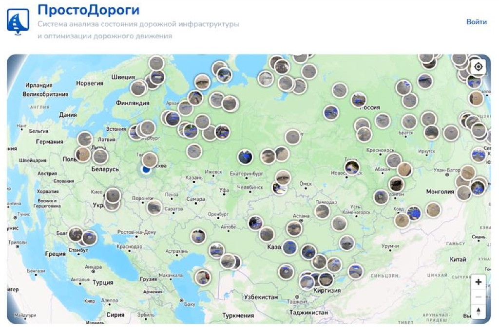
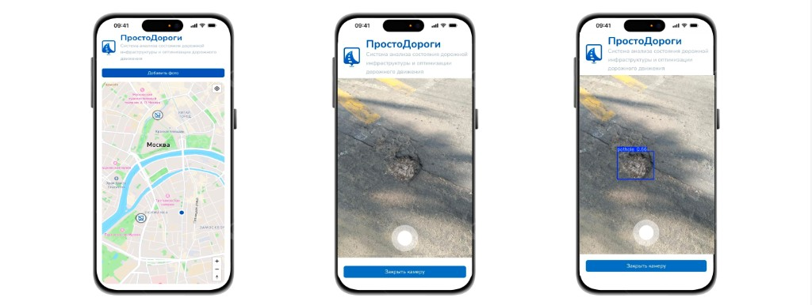

# Only Roads (ПростоДороги)

Клиентское приложение для фиксации дефектов дорожного покрытия на карте с фото и геолокацией.

**MVP**, реализованный в рамках IT-Чемпионата **«Цифровая Эра Транспорта»** (17–19 сентября 2024). Проект **победил** на чемпионате.

## Демо

<p align="center">
  
</p>

## Скриншоты

<p align="center">
  
</p>

<p align="center">
  
</p>

## О проекте

**ПростоДороги** — система анализа состояния дорожной инфраструктуры и оптимизации дорожного движения: пользователь добавляет фото дефекта, отметка появляется на карте, на кадре может отображаться детекция (например, `pothole`).

Этот репозиторий — клиентская часть сервиса Only Roads.

## Возможности

- Карта (Mapbox) с отметками дефектов
- Съёмка фото с камеры устройства
- Детекция дефектов на кадре
- Детальная карточка отметки и аннотации
- Адаптация под мобильный и desktop

## Стек

- React / TypeScript (Create React App)
- Ant Design, Framer Motion
- Mapbox GL
- React Query, Axios
- Feature-Sliced Design (`entities` / `feature` / `widgets` / `pages`)

## Структура

```
client/          # основное приложение
  src/
    entities/    # defect, mark, map, ...
    feature/     # AddPhotoPanel, DeviceProvider, ...
    widgets/     # MarkDetail
    pages/       # HomePage
docs/            # демо GIF и скриншоты
```

## Запуск

```bash
cd client
npm i
npm start
```

Ветка по умолчанию: `dev`.
